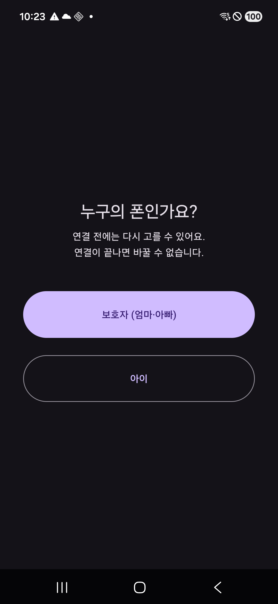
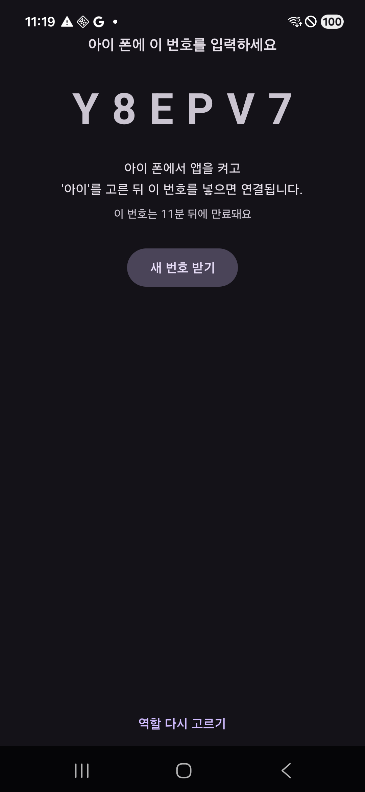
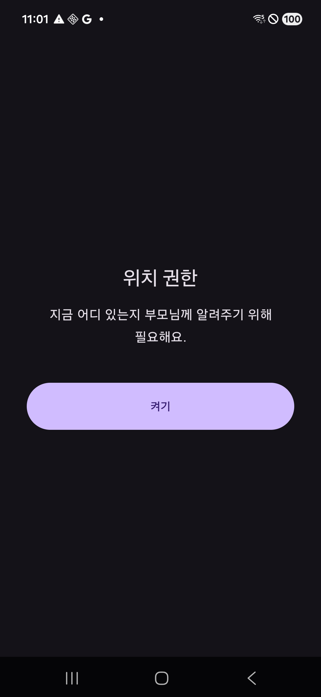
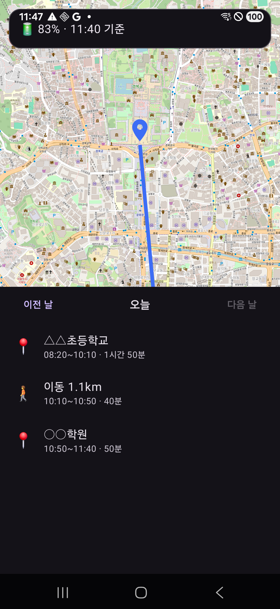

# 우리아이 지킴이 (KidCare)

부모 폰과 아이 폰에 같은 앱을 하나씩 깔고, 첫 실행 때 역할을 고르면 연결되는 자녀 관리 안드로이드 앱입니다.

아이가 하루를 어디서 어떻게 보냈는지를 **지도 위의 선과 사람이 읽는 글**로 보여주고, 부모가 아이 폰의 소리·진동을 원격으로 바꾸거나 잃어버린 폰을 울려 찾을 수 있게 합니다.

| 역할 선택 | 초대 코드 | 권한 안내 | 지도와 타임라인 |
|---|---|---|---|
|  |  |  |  |

```
📍 △△초등학교      08:20~10:10 · 1시간 50분
🚶 이동 1.1km       10:10~10:50 · 40분
📍 ○○학원          10:50~11:40 · 50분
```

---

## 무엇을 만들고 무엇을 안 만들었나

**만든 것**

- 6자리 코드로 부모 폰과 아이 폰을 연결
- 아이 폰의 위치를 배터리 상황에 맞춰 수집하고, 하루를 **머무름/이동 구간**으로 묶어 요약
- 부모 폰에서 지도(경로선 + 현재 위치)와 타임라인, 날짜별 조회
- 아이 폰의 소리·진동 원격 변경, 핸드폰 찾기, 시간대별 자동 전환 *(개발 중)*

**의도적으로 안 만든 것**

- **몰래 감시(아이콘 숨김).** 아이 폰에 앱 아이콘이 보이고, 알림줄에 "위치 공유 중"이 항상 떠 있습니다. 아이도 자기 상태를 볼 수 있습니다. 접근성 서비스로 다른 앱을 훔쳐보는 방식은 쓰지 않았습니다.
- **기기관리자 권한으로 앱 삭제 막기.** 오작동하면 폰 초기화까지 얽히는데, 아이 폰에 걸어두기엔 위험이 이득보다 큽니다. 대신 신호가 끊기면 부모에게 알립니다.
- **통화·문자·앱 사용시간 감시.** 이 앱의 범위가 아닙니다.

**배포 방식**: 가족끼리 APK 직접 설치. 플레이스토어에 올리지 않습니다.

---

## 기술 스택

| | |
|---|---|
| 언어·빌드 | Kotlin, AGP 9.2.1 (Kotlin 내장), Gradle 9.4.1 |
| SDK | compileSdk 37 / minSdk 26 / targetSdk 36 |
| UI | Views + ViewBinding + Material3, RecyclerView (Compose 미사용) |
| 백엔드 | Firebase Firestore + 익명 인증 (**무료 Spark 요금제**) |
| 지도 | osmdroid (OpenStreetMap) — **API 키 등록 불필요** |
| 주소 변환 | OpenStreetMap Nominatim — **API 키 등록 불필요** |
| 위치 | play-services-location (FusedLocationProvider, ActivityRecognition) |
| 테스트 | JUnit4 — 단위 테스트 49개 |

**외부 키가 하나도 필요 없습니다.** Firebase 프로젝트만 만들면 됩니다.

---

## 구조

```
com.kidcare.family
├─ logic/       순수 코틀린. 안드로이드 API 미사용 → JVM 단위 테스트 대상
│  ├─ InviteCode         6자리 초대 코드 생성·정규화·검증
│  ├─ LocationFilter      올릴 위치인지 판정 (정확도·이동거리·속도)
│  ├─ SegmentBuilder      위치 점 → 머무름/이동 구간
│  ├─ SegmentSummarizer   구간 → 시각·기간·거리 표기
│  └─ DayPicker           날짜 이동과 헤더 문구
├─ core/        Firestore 접근만
│  ├─ AuthGateway         익명 로그인 (동시 호출 가드)
│  ├─ FamilyRepository    가족 생성·페어링·서버 시각 보정
│  ├─ SegmentRepository   구간·위치 점 읽기/쓰기
│  ├─ CommandRepository   원격 명령 (전달 수단은 인터페이스 뒤에 숨김)
│  └─ ErrorText           예외 → 사람이 읽는 한국어 안내
├─ onboarding/  역할 선택, 양쪽 페어링, 자녀 권한 안내
├─ child/       아이 폰 전용 — 상시 포그라운드 서비스와 그 부속
└─ guardian/    부모 폰 전용 — 지도·타임라인
```

**설계 원칙 하나**: 계산은 `logic/`에, Firestore는 `core/`에, 화면·서비스는 `child/`·`guardian/`에 둡니다. `logic/`이 안드로이드 API를 쓰지 않기 때문에 까다로운 로직(자정을 넘는 시간대 규칙, GPS 흔들림 속에서 "머물렀다"를 판정하는 것)을 전부 JVM 테스트로 고정할 수 있습니다.

### 데이터 흐름

```
[아이 폰]                    [Firestore]                [부모 폰]
위치 수집 (1분/5분)
  → 필터 통과분만 업로드  ──►  points/
  → 15분마다 구간 재계산  ──►  segments/  ──────────►  타임라인 + 경로선
  → 현재 상태 덮어쓰기    ──►  children/{uid}  ─────►  마커 + 배터리

포그라운드 서비스의 리스너 ◄──  commands/  ◄──────────  버튼 누름
  → 실행 후 state 갱신    ──►               ─────────►  "전달 중… → 완료"
```

원격 명령을 FCM 푸시가 아니라 **Firestore 실시간 리스너**로 전달합니다. 아이 폰은 위치 수집 때문에 어차피 포그라운드 서비스가 상시 돌고 있어서, FCM이 사주는 "잠든 앱 깨우기"가 여기서는 필요 없기 때문입니다. 덕분에 Cloud Functions(유료 요금제)를 쓰지 않습니다. 전달 수단은 인터페이스 하나 뒤에 감춰서, 나중에 FCM으로 갈아끼워도 부르는 쪽 코드는 그대로입니다.

---

## 개발일지

### 1~2단계 — 뼈대와 페어링, 위치 수집

앱 하나에 두 역할을 넣고, 부모가 만든 6자리 코드를 아이가 입력하면 연결되는 구조를 만들었습니다. 코드 알파벳에서 `0/1/O/I/L`을 뺐습니다 — 아이가 화면을 눈으로 읽고 손으로 옮겨 적는 코드라, 잘못 읽히면 연결이 실패하고 원인도 안 보입니다.

아이 폰은 상시 포그라운드 서비스가 위치를 받아 필터를 거쳐 올립니다. 50m 이상 움직였을 때만 올리고, 정확도가 100m를 넘거나 시속 200km를 넘는 이동은 GPS 오류로 보고 버립니다.

**이 단계에서 잡은 것들**

- **익명 로그인 동시 호출 버그.** 화면 두 개가 동시에 로그인하면 익명 계정이 두 개 생기고, 화면이 든 ID와 실제 로그인된 ID가 어긋납니다. 당장은 화면이 하나뿐이라 안 터지지만, 백그라운드 서비스가 도는 순간 **"위치가 그냥 안 올라가는데 이유를 모르겠는"** 형태로 나타났을 겁니다. 보안 규칙이 ID가 안 맞는 쓰기를 조용히 거부하기 때문입니다.
- **약속과 동작의 불일치.** 화면에 "연결이 끝난 뒤에는 바꿀 수 없습니다"라고 써놓고, 실제로는 버튼을 누르는 순간 역할이 잠겼습니다. 엄마가 자기 폰에서 실수로 `아이`를 누르면 앱 데이터를 통째로 지우는 것 말고는 되돌릴 방법이 없었습니다.

### 보안 규칙 — 가장 오래 걸린 부분

Firestore 보안 규칙만 **리뷰 3회, 재작성 2회**를 거쳤습니다. 자녀 관리 앱에서는 **아이가 곧 공격자**입니다. 아이는 폰을 손에 쥐고 있고 앱의 접속 키도 갖고 있어서, 앱을 거치지 않고 데이터베이스를 직접 두드릴 수 있습니다. 앱 코드에서 아무리 검사해도 규칙이 뚫려 있으면 소용이 없습니다.

실제로 잡힌 구멍들:

1. **모든 가족의 초대 코드가 새어나갔다.** Firestore에서 `read` 권한은 "문서 하나 읽기"와 "컬렉션 전체 목록 긁기"를 둘 다 엽니다. 이걸 착각해서 목록만 열린다고 주석까지 달아놨었습니다. 로그인만 하면 **전 가족의 초대 코드를 통째로** 받아갈 수 있었습니다.
   → 코드를 **문서 이름으로** 쓰는 별도 컬렉션(`inviteCodes/A2C4K9`)으로 분리했습니다. 코드를 정확히 아는 사람만 꺼내갈 수 있고 목록 조회는 완전히 막힙니다.

2. **아무나 남의 가족에 보호자로 등록할 수 있었다.** 멤버 생성 규칙이 "본인 ID로 쓰는가"만 검사했습니다.
   → 가족을 만든 사람만 보호자가 되고(`ownerUid` 대조), 자녀는 **자기가 입력한 코드를 증거로 제출**해 서버가 대조하도록 바꿨습니다.

3. **막았더니 옆문이 열려 있었다.** 위 둘을 고친 뒤에도, 가입한 아이가 **자기 문서의 역할을 `보호자`로 바꿔** 부모를 가족에서 삭제할 수 있었습니다. 만드는 문(create)은 잠갔는데 고치는 문(update)이 열려 있던 겁니다.
   → 역할과 가입 코드를 생성 후 불변으로 만들었습니다.

4. **명령 기능을 열면서 또 한 번.** 4단계에서 부모가 명령을 쓸 수 있게 규칙을 추가할 때, 기존 재귀 와일드카드를 남겨두면 **아이도 계속 명령을 쓸 수 있습니다**(규칙은 OR로 평가). 아이가 자기 폰에 `소리 켜기` 명령을 스스로 넣어 무음 예약을 무력화할 수 있었습니다.
   → 와일드카드를 없애고 하위 컬렉션을 하나씩 명시했습니다.

### 3단계 — 하루를 글로 바꾸기

위치 점 수백 개를 "몇 시부터 몇 시까지 어디에 있었고 언제 어디로 이동했는지"로 바꾸는 단계입니다.

**머무름 판정의 핵심은 "연속 2개" 규칙**입니다. 실내에서는 GPS 좌표가 수십 미터씩 흔들리고 가끔 수백 미터를 튑니다. 반경을 벗어난 점 **하나**로 머무름을 끊으면 학교에 있는 6시간이 수십 개 구간으로 쪼개져 타임라인을 읽을 수 없게 됩니다. 그래서 벗어난 점이 연속 2개 나와야 머무름이 끝납니다. 5분을 못 채운 정지(신호 대기 같은 것)는 이동에 흡수합니다.

**이 단계에서 잡은 것들**

- **무료 한도를 태울 뻔했다.** 구간을 다시 계산할 때마다 하루치 위치를 처음부터 다시 읽게 돼 있었습니다. 점이 쌓일수록 읽는 양이 늘어서 하루 최대 **3만 6천 건** — 무료 한도가 5만이고 그건 부모 폰 몫까지 합친 총량입니다. 넘으면 경고가 뜨는 게 아니라 **그날 나머지 시간 동안 앱이 그냥 멈춥니다.**
  → 아이 폰이 자기가 방금 올린 점을 메모리에 들고 있게 바꿔 **하루 2건**으로 줄였습니다.
- **하루가 항상 24시간은 아니다.** 하루의 끝을 "시작 + 24시간"으로 계산하고 있었습니다. 한국은 서머타임이 없어 지금은 안 터지지만, 가족이 해외에 나가면 **한 시간치 위치가 어느 계산에도 안 잡혀 영영 사라집니다.** 달력 기준으로 바꿨습니다.
- **아이가 권한 하나로 추적을 반쯤 무력화할 수 있었다.** 배터리를 아끼려고 "가만히 있을 땐 5분, 움직이면 1분"으로 전환하는데, 아이가 멈춰 있는 동안 활동 감지 권한을 끄면 "움직이기 시작했다"는 신호가 올 길이 없어 **밖에 나가 돌아다녀도 계속 5분마다만** 확인하게 됩니다. 부모 화면에는 5분 전 위치가 떠 있고 이유는 안 보입니다.
  → 권한이 사라진 것을 감지하면 곧바로 1분 주기로 되돌립니다. 배터리보다 위치 신뢰성이 먼저입니다.

### 카카오맵 → OpenStreetMap

원래 카카오맵 SDK와 카카오 로컬 API를 쓰기로 했는데, 둘 다 개발자 등록과 앱키 발급이 필요했습니다. **osmdroid + Nominatim으로 바꿔 키 등록을 0개로** 만들었습니다. 되돌아갈 수 있게 카카오 설정은 주석으로 남겨뒀습니다.

Nominatim은 커뮤니티가 제공하는 무료 서비스라 사용 정책(초당 1회, 앱 식별자 표시, 결과 캐싱)이 있습니다. 코드가 그 셋을 다 지킵니다.

---

## 테스트

### 단위 테스트 49개

안드로이드 API에 의존하지 않는 계산 로직만 대상입니다. 화면과 서비스는 실기기로 검증합니다.

| 대상 | 개수 | 무엇을 고정하는가 |
|---|---|---|
| `SegmentBuilder` | 13 | GPS 튐 1개가 머무름을 깨뜨리지 않는지, 5분 경계, 구간이 끊기지 않는지 |
| `SegmentSummarizer` | 10 | 시각·기간·거리 표기, 로케일 고정 |
| `LocationFilter` | 9 | 정확도 100m 경계, 시속 200km, 시간 역행, 10분 하트비트 |
| `InviteCode` | 8 | 헷갈리는 글자 배제와 입력 교정 |
| `DayPicker` | 8 | 시간대별 오늘 판정, 윤년·월·해 경계 |
| 스모크 | 1 | 한글 경로 환경에서 테스트 워커가 도는지 |

```bash
./gradlew.bat :app:testDebugUnitTest
```

### 실기기 검증 (갤럭시 A16 · 안드로이드 16)

1~3단계 전체를 실제 폰에서 확인했습니다.

- 설치·역할 선택·익명 로그인
- 보호자 가족 생성과 초대 코드 발급 (3회, 매번 정상)
- **자녀 페어링** — 배포된 보안 규칙을 실제로 통과
- 권한 안내 → 자녀 홈 → 포그라운드 서비스 기동, 상시 알림 유지
- 위치 수집·필터 동작, 구간 재계산
- **지도(타일·마커·경로선)와 타임라인**
- 날짜 이동, 오늘 기준 다음 날 버튼 비활성
- "역할 다시 고르기"로 저장값이 완전히 초기화되는지

폰이 한 대뿐이라 **아이 폰 역할은 PC 스크립트로 대신했습니다** — 실제 두 번째 폰과 같은 방식으로 익명 로그인하고 같은 보안 규칙을 통과해 데이터를 넣습니다.

**실기기가 아니면 못 잡았을 문제 3개**

1. 오류가 **영어 원문**(`PERMISSION_DENIED: Missing or insufficient permissions.`)으로 떴습니다. 부모가 이걸 보고 할 수 있는 게 없습니다 → 한국어 안내로 교체.
2. **실패했다면서 로딩 표시가 계속 돌았습니다.** 이건 전수 리뷰가 *"오류 문구가 바로 위에 있으니 괜찮다"* 며 넘겼던 항목인데, 실제 화면에서는 스피너가 글자보다 눈에 잘 띄어 "아직 하는 중"으로 읽혔습니다. **코드만 읽고 UI를 판정하면 안 된다**는 걸 확인한 사례라 판단을 뒤집고 고쳤습니다.
3. **Firestore 복합 색인이 없으면 타임라인이 영원히 빕니다.** 지도는 멀쩡하고 목록만 비어서 "데이터가 없나 보다"로 보입니다. 예외 객체를 통째로 로그에 남기도록 해둔 덕에 생성 링크를 로그에서 건질 수 있었습니다.

---

## 설정하고 빌드하기

자세한 절차는 [`docs/setup.md`](docs/setup.md)에 있습니다. 요약하면:

1. **Firebase 프로젝트 생성** → 안드로이드 앱 추가(패키지 `com.kidcare.family`) → `google-services.json`을 `app/`에 저장
2. **익명 인증** 켜기, **Firestore** 생성(`asia-northeast3`, 프로덕션 모드)
3. **보안 규칙 게시** — `firestore.rules` 내용을 콘솔 `규칙` 탭에 붙여넣고 게시
4. **복합 색인 생성** — 앱을 한 번 실행하면 로그에 생성 링크가 나옵니다
5. 빌드

```bash
./gradlew.bat :app:assembleDebug
```

무료 Spark 요금제로 충분합니다. 카드 등록이 필요 없습니다.

---

## 문서

| | |
|---|---|
| [`docs/superpowers/specs/`](docs/superpowers/specs/) | 설계서 — 무엇을 왜 그렇게 정했는지, 결정 기록 포함 |
| [`docs/superpowers/plans/`](docs/superpowers/plans/) | 단계별 구현 계획 |
| [`docs/known-issues.md`](docs/known-issues.md) | 미해결 항목과 **"고치지 않기로 판단한 것"** + 그 이유 |
| [`docs/setup.md`](docs/setup.md) | 설정 절차와 개발 환경 함정 |
| [`firestore.rules`](firestore.rules) | 보안 규칙 (각 규칙이 무슨 공격을 막는지 주석) |

`known-issues.md`에 **고치지 않기로 한 것들과 그 근거**를 남겨둔 이유는, 나중에 같은 걸 다시 발견하고 "고쳐야지" 하며 시간을 쓰지 않기 위해서입니다.

---

## 알려진 제약

- **재설치하면 가족이 깨집니다.** 익명 로그인이라 앱을 지우면 ID가 바뀌는데 양쪽 다 되돌릴 길이 없습니다. 아이 폰에 "다시 연결" 버튼을 다는 것은 **아이가 스스로 감시를 풀 수 있게 된다**는 뜻이라 설계 판단이 필요해 보류 중입니다.
- **하루 구분을 아이 폰 날짜로 찍습니다.** 아이가 폰 날짜를 하루 앞으로 돌리면 그 뒤 기록이 부모가 못 가는 날짜에 저장됩니다. 보안 규칙으로는 막을 수 없습니다(서버가 대조할 기준이 없는 클라이언트 값이라).
- **아이 폰의 하루 종일 실사용은 아직 미검증입니다.** 삼성 절전 정책이 서비스를 죽이는지, 실내에서 위치 정확도가 모자라 전부 걸러지는지는 두 번째 폰이 있어야 알 수 있습니다.

---

## 개발 현황

| 단계 | 내용 | 상태 |
|---|---|---|
| 1~2 | 뼈대·페어링·권한·위치 수집·지도 | ✅ 완료 |
| 3 | 구간 요약·타임라인·경로선·수집 주기 전환 | ✅ 완료 |
| 4 | 소리·진동 원격 변경, 핸드폰 찾기, 시간대별 예약 | 🔨 진행 중 |
| 5 | 장소 반경 알림, 원격 알람, 메시지 | 예정 |
| 6 | 오프라인 버퍼, 예외 화면, 릴리스 빌드 | 예정 |

커밋 45개 · 코틀린 30파일 3,157줄 · 테스트 6파일 474줄
